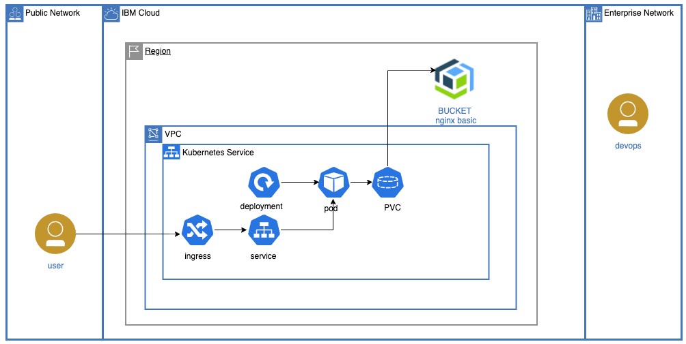

# Kubernetes Persistent Volumes Backed by IBM Cloud Object Storage Buckets

When you imagine a file system, you are probably thinking of the block storage provided by disk drives. Object storage buckets can also be used for file system volumes on Kuberrnetes and might fit well into your application. For example, buckets can be managed outside of the application with a variety of tools and the IBM Cloud Console. Getting data in and out is a breeze.

This repository contains scripts and terraform to create all of the resources.  Basic steps are:
- cp template.local.env local.env
- edit local.env; #make suggested changes
- source local.env
- ./000-prereq.sh
- ./010-container-registry.sh
- ./020-create-cluster.sh
- ./025-create-resources.sh
- ./030-test.sh
- ./040-cleanup.sh

The blog article related to this repo can be found at:

https://www.ibm.com/cloud/blog/kubernetes-persistent-volumes-backed-by-ibm-cloud-object-storage-buckets
